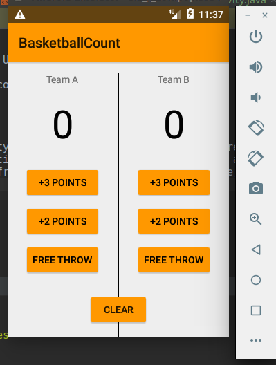

```txt

Udacity - Android Basics: User Input

Project Basketball match count

minSdkVersion=16
compileSdkVersion=28

What I am learn:
    - change app style. styles.xml > <style name="AppTheme" parent="Theme.AppCompat.Light">
        then change a specific properties (Ctrl + space to see all)
    - start build layout from basic and use max available space, then add other elements, each step per element
    - starting from sdk 26 findViewById does not require cast
        https://stackoverflow.com/questions/45092494/android-o-casting-to-findviewbyid-not-needed-anymore/45092546
    - avoid core repetition by implement a new class out of Activity and delegate work to this class
        TeamScore.java
        require:
            bind the buttons (source)
            bind the target  (target)
            implement View.OnClickListener interface
```
